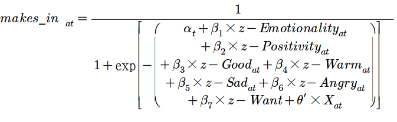

# 2020 Marketing Research Crawling

2020.10.07

---

[TOC]

---

## INTRO

> 이 소스 코드는 2020년 1학기 마케팅조사론 수업 논문 Replication 과제 자료 수집에 사용된 코드이다. Replication 대상 논문은 `What Makes Online Content Viral? (Berger and Milkman, 2012)`이며, 온라인 컨텐츠의 확산모형을 분석해 온라인 컨텐츠에서의 감정 표현과 컨텐츠 virality 간의 상관관계를 검증하는 것을 목표로 한다.

## COPYRIGHT

> 이 코드의 저작권은 서울대학교 경영대학 마케팅전공 석사과정 이송영, 산업공학과 석박사통합과정 안동현에게 있다.

## MAIN THESIS

> **Content that evokes high arousal emotion is more likely to be shared.**

- H1: 긍정적인 감정을 환기시키는 컨텐츠는, 부정적인 감정을 환기시키는 컨텐츠에 비해  더 바이럴 할 것이다.
- H2: 모두 부정적인 감정을 환기시키는 컨텐츠일지라도 , 분노(anger)와 같은 고활성화(highly-activated) 감정은 슬픔과 같은 저활성화 감정에 비해 전파를 증가시킬 것이다

## 소스코드 목적
- 디지털 컨텐츠의 확산모형을 검증하기 위해서 작성되었다.
- 네이버 뉴스와 조선 일보 온라인 뉴스 기사를 crawling 한다.
  - 2020년 5월 22일 ~ 2020년 6월 11일 3주간 하루 12차례(2시간 간격)으로 총 2249개의 기사를 크롤링하였다.

## 패키지 간단한 설명
- `pandas` : 데이터 분석/조작을 위한 라이브러리
- `KoNLPy` : 한글 형태소 분석기
- `Selenium` : 자동화 방식의 웹크롤링 도구
- `Beautifulsoup` : HTML과 XML 문서를 파싱하기위한 파이썬 패키지

## 데이터 가공

**Logistic Regression Model**

- `KNU 감성어 사전`을 이용하여 긍정어, 부정어, 중립어 및 미등록 단어를 구분하였다.

- 중복된 기사 삭제
- positivity, emotionality 계산
- 감정표현 Z값 계산
- 범주형 데이터 dummy 변수 생성

## 데이터 분석

**위계적 로지스틱 회귀분석**

- 5단계로 분석

***Copyright* ©  2020 Song_Artish**